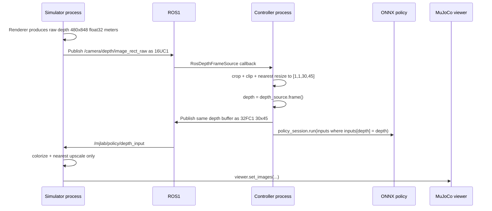

# MuJoCo Viewer 集成 Policy Depth 可视化：实现计划

## 1. 目标与结论

目标是在现有 MuJoCo viewer 窗口中显示 **实际传给 ONNX policy 的 depth tensor**，而不是 simulator 刚渲染出的原始深度。

主方案采用一条只用于诊断的 ROS1 回传链路：

1. simulator 渲染并发布原始 `480 x 848` 深度；
2. controller 按当前代码裁剪、缩放和截断，得到 policy 输入 `float32 [1, 1, 30, 45]`；
3. controller 在调用 `policy_session.run()` 前，将同一个 `depth` 数组发布到 `/mjlab/policy/depth_input`；
4. simulator 订阅该 topic，将 `30 x 45` 数组伪彩色化、最近邻放大后，通过 MuJoCo 3.10 的 `viewer.set_images()` 叠加到主 viewer。

这是唯一能同时保证“预处理结果一致”和“policy 实际选中的帧一致”的方案。不要把 simulator 端重新执行一次 `preprocess_depth_image()` 作为主方案：它虽然数值算法可以一致，但 ROS queue、帧丢弃、staleness 检查和 controller 的 50 Hz inference 时序会导致 simulator 端未必选中同一帧。

降级方案为直接显示 simulator 的 raw depth，并明确标记 `RAW CAMERA — NOT POLICY INPUT`。

## 2. 当前代码事实

- 原始深度由 `pointfoot-mujoco-sim/simulator.py::_export_depth_frame()` 生成，单位为米，类型为 `float32 [H, W]`。
- ROS 原始深度 topic 为 `/camera/depth/image_rect_raw`，消息编码为 `16UC1` 毫米。
- controller 的 ROS callback 已经执行完整预处理：毫米转米、`[0, 10] m` clip、裁掉 D435 左侧 `128 / 848` FOV、最近邻 resize。
- policy depth shape 是 `[1, 1, 30, 45]`。
- `WheelfootController.compute_actions()` 中的局部变量 `depth` 就是传入 ONNX 的最终张量。
- controller loop 为 500 Hz，`decimation=10`，所以 policy inference 约为 50 Hz；原始相机 capture 默认 30 Hz，因此相邻 inference 可能重复使用同一深度帧，这是正常且应该被准确反映的行为。
- simulator 与 controller 是两个独立进程，controller 无法直接调用 simulator 的 viewer handle。
- 项目固定使用 `mujoco==3.10.0`，该版本支持 `viewer.viewport`、`viewer.set_images()`、`viewer.set_texts()` 和 `viewer.set_figures()`。

## 3. 目标数据流



注意：simulator 收到 policy depth 后只能做“显示变换”（伪彩色和放大），不得再做 crop、clip、单位转换或 policy preprocessing。

## 4. 配置接口

新增以下环境变量：

| 变量 | 默认值 | 作用 |
|---|---:|---|
| `MJLAB_DEPTH_OVERLAY` | `off` | `off`、`policy` 或 `raw` |
| `MJLAB_POLICY_DEPTH_TOPIC` | `/mjlab/policy/depth_input` | controller 到 simulator 的 policy depth debug topic |
| `MJLAB_DEPTH_OVERLAY_WIDTH` | `360` | viewer 中显示宽度 |
| `MJLAB_DEPTH_OVERLAY_HEIGHT` | `240` | viewer 中显示高度；360:240 保持 45:30 比例 |
| `MJLAB_DEPTH_OVERLAY_MARGIN` | `12` | 距 3D viewport 边缘的像素 |
| `MJLAB_DEPTH_OVERLAY_MIN` | `0.0` | 伪彩色下限，单位米 |
| `MJLAB_DEPTH_OVERLAY_MAX` | `10.0` | 伪彩色上限，默认与 policy clip 一致 |
| `MJLAB_DEPTH_OVERLAY_COLORMAP` | `turbo` | `turbo` 或 `gray` |
| `MJLAB_DEPTH_OVERLAY_MAX_AGE` | `0.5` | 超过此时间显示 stale，不继续展示旧图 |

配置语义：

- `MJLAB_DEPTH_OVERLAY=policy`：controller 发布最终 policy tensor，simulator 订阅并显示；这是推荐模式。
- `MJLAB_DEPTH_OVERLAY=raw`：simulator 直接显示 `_export_depth_frame()` 的 raw depth；不声称是 policy 输入。
- `MJLAB_DEPTH_OVERLAY=off`：不创建 debug publisher/subscriber，不调用 viewer image API。
- 不要静默从 `policy` 自动回退到 `raw`。收不到 policy topic 时应显示 `Waiting for policy depth` 或 `Policy depth stale`，避免工程师误判当前画面语义。

## 5. 文件级修改计划

### 5.1 `rl-deploy-with-python/mjlab_repts_lin_depth.py`

增加 policy depth debug sink，建议接口：

```python
class PolicyDepthDebugSink:
    def publish(self, depth: np.ndarray, inference_seq: int) -> None:
        raise NotImplementedError


class NullPolicyDepthDebugSink(PolicyDepthDebugSink):
    def publish(self, depth, inference_seq):
        pass


class Ros1PolicyDepthDebugPublisher(PolicyDepthDebugSink):
    ...


def create_policy_depth_debug_sink() -> PolicyDepthDebugSink:
    ...
```

`Ros1PolicyDepthDebugPublisher.publish()` 要求：

1. 接受且只接受 `[1, 1, 30, 45]`；shape 不对要在开发测试中报错。
2. 使用 `np.ascontiguousarray(depth.reshape(30, 45), dtype="<f4")`。
3. 发布 `sensor_msgs/Image`：
   - `height = 30`
   - `width = 45`
   - `encoding = "32FC1"`
   - `is_bigendian = 0`
   - `step = 45 * 4 = 180`
   - `data = depth_2d.tobytes()`
   - `header.seq = inference_seq`
   - `header.stamp = rospy.Time.now()`
   - `header.frame_id = "policy_depth_input"`
4. publisher 使用 `queue_size=1`，不 latch。
5. debug 发布失败必须是 best-effort：限频打印 warning，但绝不能让 policy inference 抛异常或阻塞。
6. 默认返回 Null sink；只有 `MJLAB_DEPTH_OVERLAY=policy` 时才 import/初始化 ROS publisher。

不应把伪彩色 RGB 从 controller 发出去。发布 `32FC1` 保留真实 policy 数值，使 simulator 可以显示 min/max、检查无效值，也便于 `rostopic` 或其他工具复用。

### 5.2 `rl-deploy-with-python/controllers/WheelfootController.py`

初始化阶段：

- depth policy 分支创建 `self.policy_depth_debug_sink`。
- 初始化 `self.policy_inference_seq = 0`。
- non-depth policy 使用 Null sink，不能引入 ROS 依赖。

修改 `compute_actions()` 的 depth 分支。发布点必须放在 `policy_session.run()` 之前：

```python
depth = np.ascontiguousarray(self.depth_source.frame(), dtype=np.float32)

self.policy_depth_debug_sink.publish(
    depth,
    inference_seq=self.policy_inference_seq,
)

inputs = {
    ...,
    self.policy_input_names[2]: depth,
    ...,
}
output = self.policy_session.run(self.policy_output_names, inputs)
self.policy_inference_seq += 1
```

准确性要求：debug sink 和 ONNX inputs 必须接收同一个局部变量 `depth`。不得为了显示再调用一次 `depth_source.frame()`，也不得在 publish 与 `policy_session.run()` 之间修改该数组。

允许每个 50 Hz inference 都发布，包括连续两次内容相同的情况；单帧只有 `30 * 45 * 4 = 5400` bytes，开销很小，并且这样 sequence 与 inference 一一对应。

### 5.3 `pointfoot-mujoco-sim/simulator.py`

增加 `_Ros1PolicyDepthSubscriber`：

- 订阅 `MJLAB_POLICY_DEPTH_TOPIC`，`queue_size=1`。
- 只接受 `32FC1`、`30 x 45`、little-endian。
- callback 只解析消息并在 lock 下保存：
  - latest `float32 [30, 45]`
  - `header.seq`
  - receive wall time
- callback 中禁止调用 `viewer.set_images()`；viewer 更新必须留在 simulator 主循环。
- `latest()` 返回小数组 copy 和 metadata，避免 ROS callback 与 render loop 并发访问。

初始化行为：

- `overlay=policy`：创建 subscriber。
- `overlay=raw`：不创建 subscriber；确保 raw depth renderer 被启用，即使没有 NPY/ROS sink。
- `overlay=off`：不增加任何运行期开销。

增加 `_update_depth_overlay()`：

1. policy 模式从 subscriber 取最新 `[30,45]`。
2. raw 模式从 `_export_depth_frame()` 缓存的最新 raw frame 取值。
3. 检查 age；无数据/stale 时 clear image 并用 `viewer.set_texts()` 显示状态。
4. 将深度伪彩色化为 `uint8 [H,W,3]`。
5. 使用最近邻放大至 overlay 尺寸；policy 模式必须使用最近邻，避免双线性插值制造不存在的深度结构。
6. 根据 `viewer.viewport` 动态计算右下角或右上角 `mujoco.MjrRect`，处理窗口 resize。
7. 调用 `viewer.set_images((rect, rgb))`。
8. 可用 `viewer.set_texts()` 显示：
   - `POLICY INPUT 30x45`
   - inference seq
   - message age
   - finite depth min/max
9. image 和 text 不得占用同一矩形；MuJoCo user image 在 user text/figure 之后绘制，会盖住重叠内容。

建议在当前 `frame_count % 20 == 0` 的 viewer 更新位置调用 `_update_depth_overlay()`，随后 `viewer.sync()`。这与 1000 Hz simulator / 20 = 50 Hz viewer refresh 对齐，也与 policy inference 约 50 Hz 对齐。

raw 模式下，在 `_export_depth_frame()` 中仅缓存：

```python
self.latest_raw_depth = depth.copy()
```

不要在 ROS callback 或 depth export 中直接操作 viewer，以保持渲染调用位置单一。

### 5.4 新增 `pointfoot-mujoco-sim/depth_visualization.py`

把纯显示函数集中到该文件：

- `colorize_depth(depth_m, min_depth, max_depth, colormap)`
- `resize_rgb_nearest(rgb, height, width)`
- `fit_overlay_size(source_shape, viewport_size, preferred_size, margin)`

函数必须不依赖 ROS、pygame 或 viewer，便于单元测试。

将 `scripts/depth_image_viewer.py` 当前的 `colorize_depth()` 和 turbo palette 移入该模块，原 pygame viewer 改为导入复用，避免两种 viewer 显示规则漂移。

### 5.5 `scripts/start_sim2sim.sh`

- export 新增的 overlay mode、topic、尺寸、colormap 等环境变量。
- 日志中打印：
  - `MJLAB_DEPTH_OVERLAY`
  - `MJLAB_POLICY_DEPTH_TOPIC`
  - overlay min/max 和尺寸
- 当 overlay mode 不是 `off` 时，默认不要再启动 `scripts/depth_image_viewer.py`。
- 如果用户显式设置 `MJLAB_DEPTH_VIEW=1`，可以允许同时启动独立窗口，便于调试，但文档应说明会看到两个 viewer。

### 5.6 `scripts/docker_run_sim2sim_ros1.sh`

分两步 rollout：

1. 首个 PR 中默认 `MJLAB_DEPTH_OVERLAY=off`，用显式环境变量做验证。
2. 验证通过后，在有 `DISPLAY` 且 `RL_TYPE=mjlab_repts_lin_depth` 时默认：

```bash
export MJLAB_DEPTH_OVERLAY="${MJLAB_DEPTH_OVERLAY:-policy}"
export MJLAB_POLICY_DEPTH_TOPIC="${MJLAB_POLICY_DEPTH_TOPIC:-/mjlab/policy/depth_input}"
export MJLAB_DEPTH_VIEW="${MJLAB_DEPTH_VIEW:-0}"
```

### 5.7 文档

更新：

- `README.md`
- `doc/ros1_depth_sim2sim.md`
- `AGENTS.md` 中已过期的 `28 x 48` 描述

明确区分：

- raw camera：`480 x 848`
- policy input：`[1,1,30,45]`
- policy input 的预处理：左裁剪、clip、nearest resize
- overlay mode 的启用、关闭和 fallback 命令

## 6. 推荐实现顺序

### 阶段 A：viewer vertical slice

1. 提取 `depth_visualization.py`。
2. 在 simulator 中实现 `overlay=raw`。
3. 用 raw frame 验证 `viewer.set_images()`、viewport 坐标、resize 和 Docker GL 环境。

这一阶段只验证显示端，不作为最终交付语义；画面必须标记 RAW。

### 阶段 B：exact policy input transport

1. 增加 controller debug publisher。
2. 在 `compute_actions()` 的准确 hook 点发布同一 `depth` 变量。
3. 增加 simulator policy subscriber。
4. 将 overlay 数据源切换为 policy topic。
5. 加入 seq、age、shape 状态文字。

### 阶段 C：launcher、测试和文档

1. 接入环境变量和进程启动逻辑。
2. 完成 unit tests。
3. Docker smoke test 与性能检查。
4. 更新 README、ROS 文档和 AGENTS。

## 7. 单元测试计划

扩展 `rl-deploy-with-python/tests/test_mjlab_repts_lin_depth_alignment.py`，必要时新增 `test_depth_overlay.py`。

必须覆盖：

1. **Policy message wire format**
   - 输入 shape `[1,1,30,45]`
   - 输出 `32FC1`、`30 x 45`、step 180
   - `msg.data` 与输入 float32 bytes 完全一致
   - seq 正确递增

2. **Exact inference tensor**
   - fake depth source 返回唯一测试数组
   - fake debug sink 捕获数组
   - fake ONNX session 捕获 `inputs["depth"]`
   - 使用 `np.testing.assert_array_equal()` 验证两者与源数组完全相同
   - 验证每次 inference 只调用一次 `depth_source.frame()`

3. **Best-effort diagnostics**
   - fake sink 抛异常时，`compute_actions()` 仍完成 ONNX inference
   - warning 要限频，避免 50 Hz 刷屏

4. **Subscriber decode**
   - 正确解析 `32FC1`
   - 拒绝错误 encoding 和 shape
   - queue/latest 语义只保留最新帧
   - stale 检查正确

5. **Visualization functions**
   - 输出为 contiguous `uint8 [H,W,3]`
   - 0/NaN 为黑色
   - min/max 映射稳定
   - 30x45 最近邻放大后不产生插值颜色边界

6. **Viewer adapter**
   - mock viewer 检查 `set_images()` 收到的 image shape 与 `MjrRect` 一致
   - resize viewer viewport 后 rect 被重新计算
   - policy 无帧或 stale 时 clear image 并显示状态文字
   - overlay off 时不 import ROS、不调用 viewer image API

现有完整测试命令：

```bash
uv run --with pytest pytest rl-deploy-with-python/tests
bash -n scripts/start_sim2sim.sh scripts/docker_run_sim2sim_ros1.sh
```

## 8. Docker 集成验证

显式启动推荐模式：

```bash
MJLAB_DEPTH_OVERLAY=policy \
MJLAB_DEPTH_VIEW=0 \
/work/scripts/docker_run_sim2sim_ros1.sh
```

检查 debug topic：

```bash
rostopic info /mjlab/policy/depth_input
rostopic hz /mjlab/policy/depth_input
rostopic echo -n 1 /mjlab/policy/depth_input/height
rostopic echo -n 1 /mjlab/policy/depth_input/width
rostopic echo -n 1 /mjlab/policy/depth_input/encoding
```

预期：

- topic 频率约 50 Hz；相邻消息内容允许相同，因为 raw capture 是 30 Hz。
- `height=30`、`width=45`、`encoding=32FC1`。
- MuJoCo 主窗口显示像素化的 45x30 policy depth，不再出现单独 pygame 窗口。
- overlay 标签明确为 `POLICY INPUT 30x45`。
- 关闭 controller 后 simulator/viewer 不崩溃，overlay 变为 stale。
- 关闭 overlay 后 policy action、hidden state 更新和控制循环行为与修改前一致。

建议记录 overlay off/on 两次运行的 simulator real-time ratio 和 controller loop warning。验收标准为没有持续 deadline miss；viewer overlay 不应成为控制回路阻塞点。

## 9. 验收标准

只有满足以下条件才算完成：

1. viewer 中显示的是 controller 在当前 inference 中传给 ONNX 的 `depth` 变量。
2. 单元测试证明 debug publisher 与 ONNX input 数组逐元素完全一致。
3. 显示端不重新执行 policy preprocessing，只做 colorize 和 nearest upscale。
4. policy overlay 显示 shape、seq、age，并能明确报告 waiting/stale。
5. debug 发布或订阅失败不会终止 controller、simulator 或 policy inference。
6. `MJLAB_DEPTH_OVERLAY=off` 能完全恢复旧行为。
7. `MJLAB_DEPTH_OVERLAY=raw` 可作为显式 fallback，并在画面中标明它不是 policy input。
8. 现有 depth preprocessing、controller alignment 测试和 launcher shell 检查全部通过。

## 10. 不建议的实现

- 不要让 simulator 对 raw depth 再做一次 policy preprocessing，并把它命名为 policy input；帧选择可能不一致。
- 不要从 controller 发布伪彩色 RGB；这会丢失真实 depth 数值。
- 不要把 30x45 depth 塞进 MuJoCo `sensordata`；它不是模型物理 sensor，且已有更直接的 `set_images()` API。
- 不要在 ROS subscriber callback 中调用 viewer/OpenGL API。
- 不要使用双线性插值放大 30x45 policy tensor；显示时应保留离散输入像素。
- 不要在收不到 policy topic 时静默显示 raw depth。
